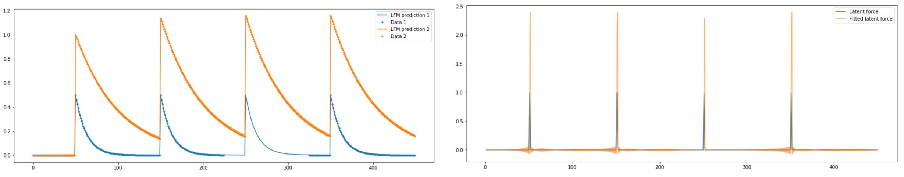
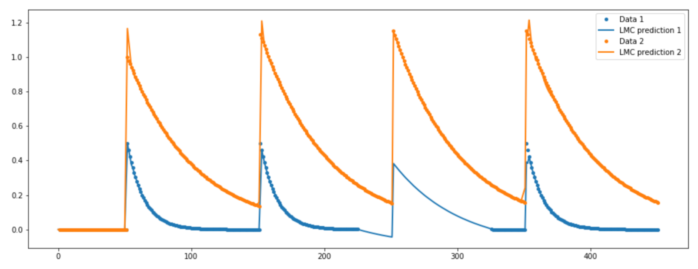

# Using Latent Force Models to encode domain knowledge in Gaussian Process Regression 

Latent Force Models (LFMs) are a way to encode knowledge of the governing equations of a system of interest into GP regression. This blog post aims to present the model as hybrid approach, neither purely physics-based nor purely statistical. 

Consider the (super interesting) scenario where we assume that the signals you are observing $y_q(t)$ are governed by an underlying ordinary differential equation (ODE) with one or more Gaussian process latent forcings. We follow the procedure described in [(Alvarez et al. 2009)](http://proceedings.mlr.press/v5/alvarez09a/alvarez09a.pdf) which shows that the solution to the ODE is itself a Gaussian process over the outputs with a multi-output kernel which contains parameters of the underlying ODE.

$$
.
$$

## LFM Model
We consider a set of $Q$ signals $\mathcal{D}_q = \{  t_{q,i},\, y_{q,i} \}_{i=1}^{N_q}$.
We assume that the signals are governed by a system of ordinary differential equations (ODEs) defined by the linear differential operators $L_q$, and acted on by $R$ latent force functions:
$$    L_q\{y_q(t)\} = \sum_{r=1}^R S_{r,q} f_r(t) $$

The correlation between signals thus arises as a result of their coupling with the set of $R$ latent forces (LFs). Under null initial conditions, the solution $y_q(t)$ to a linear differential equation with constant coefficients can be expressed as the convolution of the latent force functions (right hand side of the above ODE), with the impulse response function $G_q(t)$ of the differential operator which encodes all the information of the ODE:
$$	y_q(t) = \sum_{r=1}^{R}{S_{r,q} \int_{0}^{t}{f_r(\tau) G_q(t-\tau) \textrm{d}\tau}} $$

This is a so-called [*process convolution*](https://arxiv.org/abs/1106.6251), where the smoothing kernel takes the form of the impulse response function $G_q(t)$. The outputs $y_q(t)$ are therefore governed by a Gaussian process with a multi-output kernel. Assuming that the latent forces are independent we get 
$$
	k_{y_p y_q}(t,t') = \sum_{r=1}^{R} S_{r,p} S_{r,q} \int_0^t G_p(t-\tau) \int_0^t G_q(t'-\tau')  k_{f_r}(\tau,\tau') d\tau' d\tau.
$$

where $k_{f_r}$ is the kernel function of the Gaussian process prior over latent force $f_r(t)$. The form of the multi-output kernel depends on the impulse response of the differential operator and will therefore contain physically meaningful parameters of the underlying ODE. For some differential operators and choices of priors over latent forces we obtain a closed-form solution, as will be shown below.

This framework also allows us to infer the latent forces which act upon the physical system. In order to derive their predictive distribution we need to compute the covariance between observations and latent forces $cov(f_r(t),\, y_q(t'))$. The cross covariance kernel is given by
$$
k_{f_r y_q}(t,t') = S_{r,q} \int_0^t k_{f_r}(t,\tau) G_q(t'-\tau)  d\tau
$$
which is a simpler expression to compute than the double integral of the multi-output kernel above.

$$
.
$$

## LFMs exemplified

Neither a purely physics-based nor statistical method, the LFM lends from both approaches.

Consider a synthetic dataset generated by a 1st order ODE governing two signals that are linked to the same latent force. We remove the data from one of the time series between the values of t=225 and t=325 to illustrate how this approach copes with missing data. The latent force is a superposition of delta-functions at $t=50, 150, 250$ and $350$.

Let us try a fully physics-based approach beginning from the analytical solution to the 1st order inhomogeneous ODE:
$$
y_q(t) = \frac{B_q}{D_q} + \sum_{r=1}^R S_{rq} \exp(-D_q t) \int_0^t f_r(\tau ) \exp (D_q \tau ) d \tau
$$
Since the latent force $f$ is unknown we can discretize the integral above, splitting $f$ into discrete values which one could fit by minimizing some cost function. For this, we can compute the squared loss between this purely theoretical solution and find the parameters minimizing the error. Below we see the fit of the two signals on the left and the fit of the latent forces on the right.

We note that the mechanistic model fits the data nicely and does very well in interpolating the gap. It also fits the latent force very well, up to a multiplicative constant which we also saw for the LFM. The LFM does similarly well in this problem as shown below

As a purely statistical approach we chose the [Linear Model of Coregionalization (LMC)](https://arxiv.org/abs/1106.6251). The figure below shows the LMC does not do as well as the LFM or the purely mechanistic model despite trying different kernel functions. The LMC and the LFM are essentially the same model (a multi-output GP) using two different multi-output kernel functions.

The conclusion is of course that the function is very hard to model, due to its many discontinuities, unless we use a prior over the function that is a good fit (which we can do in the case of the mechanistic model or the LFM). In the shown examples we are able to obtain a good fit since we derived the kernel for the GP prior from the underlying governing equations.

The mechanistic approach described above does not work well outside synthetic experiments, however, because it is too faithful to the analytical solution of the ODE and, as described in [our paper (link to come)](https://arxiv.org), when the 1st order ODE is only an approximation to the system, this apporach does poorly. The LFM, however, can model noise and is more flexible, and leads to inference of physically meaning parameters and latent forces. In this way the LFM combines the best of both worlds.

$$
.
$$